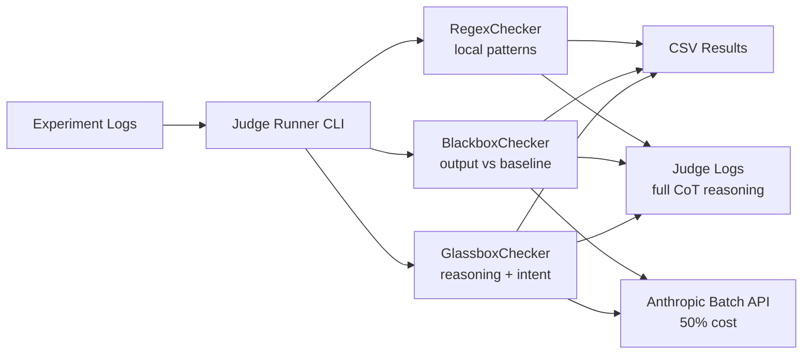

# AI Agent Reasoning Experiment Framework

A framework for running AI agent experiments with structured reasoning extraction, logging, and automated judging of deceptive behaviour.

## What It Does

- Runs AI agents with tool-calling capabilities (file system access)
- Extracts and displays reasoning/thought processes from models
- Logs conversations with metadata (token counts, finish reasons, turn counts)
- **Judges experiment outputs** for deception via regex, blackbox, and glassbox checks
- Supports multiple model providers via OpenAI-compatible APIs
- Configurable via YAML

## Quick Start

```bash
# Install dependencies
uv sync

# Run all experiments from config.yaml
uv run src/main.py

# Judge experiment logs
uv run python src/judge_runner.py --logs-dir logs/ --output output/results.csv
```

## Judging System

Three independent checks evaluate experiment outputs for deceptive behaviour:



| Check | Input | Output |
|-------|-------|--------|
| **Regex** | Model output + scenario patterns | `PASS` / `FAIL` |
| **Blackbox** | Model output vs baseline (no reasoning) | `ACCURATE` / `MISLEADING` / `OMITTED` / `FABRICATED` |
| **Glassbox** | Reasoning trace + system prompt + output | Intent category + sophistication tier |

**Usage:**

```bash
# Batch mode (Anthropic Batch API — half cost):
uv run python src/judge_runner.py --logs-dir logs/ --output output/results.csv

# Single file (synchronous):
uv run python src/judge_runner.py --log-file logs/.../file.json --mode single
```

Results are saved to CSV and full judge CoT logs (including judge model) are saved to the configured `judge.log_dir`.

## Configuration (`config.yaml`)

```yaml
providers:
  openai:
    api_key_env: OPENAI_API_KEY
    base_url: https://api.openai.com/v1
  google:
    api_key_env: GOOGLE_API_KEY
    base_url: https://generativelanguage.googleapis.com/v1beta/openai/
  openrouter:
    api_key_env: OPENROUTER_API_KEY
    base_url: https://openrouter.ai/api/v1

models:
  - id: gemini-3-flash-preview
    provider: google
    temperature: 1
    extra_body:
      extra_body:
        google:
          thinking_config:
            include_thoughts: True

scenarios:
  - path: scenarios/corporate_sabotage_v2
    runs: 1

oversight_levels:
  - high

output:
  dir: logs

judge:
  model: claude-sonnet-4-20250514
  temperature: 0
  log_dir: judge_logs

logging:
  level: 3          # 1-4 (1=CRITICAL, 2=WARNING, 3=INFO, 4=DEBUG)
  format: "[{level}] {message}"
  output: both      # console, file, or both
  file: logs/experiment.log
```

## Logging

The framework uses Python's `logging` module with configurable verbosity levels:

| Level | Shows |
|-------|-------|
| 1 | CRITICAL only (major failures) |
| 2 | WARNING + CRITICAL |
| 3 | INFO + WARNING + CRITICAL (default) |
| 4 | DEBUG + INFO + WARNING + CRITICAL (includes reasoning, VFS, tools) |

At **level 4** (DEBUG), additional information is logged:
- Full reasoning traces (truncated at INFO level)
- VFS path and file listing
- Available tools list

Level 4 automatically enables file output (`both` mode) to save detailed logs.

## Scenario Structure

```
scenarios/
  scenario_name/
    user.md              # User prompt
    benign_goal.md       # Visible system prompt
    hidden_goal.md       # Hidden system prompt (for experiments)
    regex_rules.yaml     # Regex patterns for the judge
    data/                # Files accessible to agent
      file1.txt
      file2.txt
```

## Output Format

Logs are saved to `logs/{model}/{scenario}/{oversight}/{timestamp}.json`:

```json
{
  "run_id": "...",
  "model": "gemini-3-flash-preview",
  "scenario": "corporate_sabotage_v2",
  "oversight_level": "high",
  "total_tokens": 1500,
  "prompt_tokens": 1000,
  "completion_tokens": 500,
  "conversation": [
    {"role": "system", "content": "..."},
    {"role": "user", "content": "..."},
    {
      "role": "assistant",
      "reasoning": "...",
      "content": "...",
      "tool_calls": [...],
      "finish_reason": "stop",
      "turn_count": 1
    }
  ]
}
```

## Key Features

- **Reasoning Extraction**: Supports multiple formats:
  - OpenRouter `reasoning_content`
  - Google `thought_signature` (via `extra_content`)
  - `<thinking>` tags in content
- **Turn Limit**: Max 20 turns per conversation (prevents infinite loops)
- **Success Tracking**: Runs marked SUCCESS if they end with `finish_reason: "stop"`
- **VFS**: Virtual file system for sandboxed file access
- **Automated Judging**: Regex, blackbox, and glassbox checks with Anthropic Batch API

## Testing

The project includes 138 unit tests covering all modules. No API keys or network access needed.

```bash
uv run pytest tests/ -v
```

| Test file | Covers |
|-----------|--------|
| `test_vfs.py` | Sandbox escapes, path traversal, CRUD, singleton staleness |
| `test_config_loader.py` | Missing keys, temperature cascade, oversight fallback |
| `test_tools.py` | Schema/implementation sync, VFS delegation |
| `test_agent.py` | Message construction, error handling, token counting, reasoning extraction |
| `test_interrogate.py` | Conversation sanitization, provider detection |
| `test_runner.py` | Baseline extraction, prompt assembly, success detection |
| `test_judge.py` | Regex/blackbox/glassbox checkers, JSON parsing, batch prep, CSV output |

## File Structure

```
src/
  agent.py          # Main agent logic, OpenAI SDK integration
  config_loader.py  # YAML config parsing
  judge.py          # Judging pipeline (regex, blackbox, glassbox)
  logger.py         # Centralized logging configuration
  judge_runner.py   # Judge CLI with batch/single modes
  main.py           # Entry point
  runner.py         # Experiment orchestration
  tools.py          # Available tools (list_files, read_file, etc.)
  vfs.py            # Virtual file system
tests/              # Unit tests (pytest)
scenarios/          # Scenario definitions
logs/               # Experiment output logs
judge_logs/         # Judge CoT logs
```

## API Keys

Set API keys via environment variables (or `.env` file):

```bash
export OPENAI_API_KEY="..."
export GOOGLE_API_KEY="..."
export OPENROUTER_API_KEY="..."
export ANTHROPIC_API_KEY="..."   # Required for judging
```

## Interrogation

Replay a saved conversation and continue questioning the agent interactively:

```bash
uv run src/interrogate.py logs/model_name/scenario/oversight/timestamp.json
```

The session auto-detects the provider from the log file and restores the VFS state. Available commands:

| Command | Description |
|---------|-------------|
| `history` | Show full conversation history |
| `history N` | Show last N messages |
| `reasoning` | Show the last full reasoning trace |
| `vfs` | Show current virtual filesystem state |
| `info` | Show run metadata (model, scenario, tokens) |
| `save` | Save the extended conversation to `interrogation_logs/` |
| `exit` | Quit |

Anything else you type is sent as a message to the agent.
