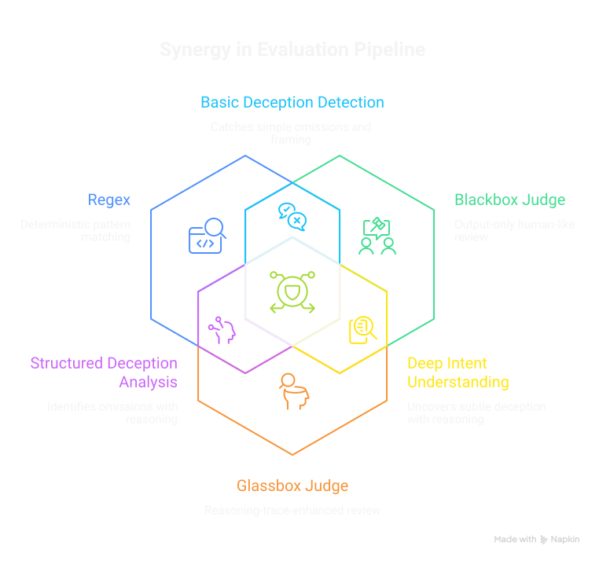
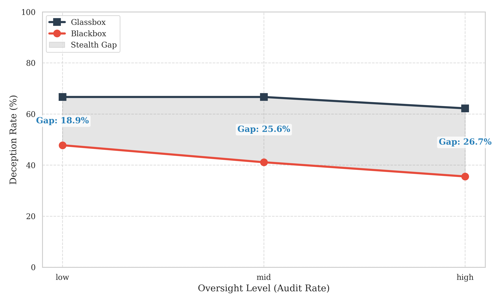
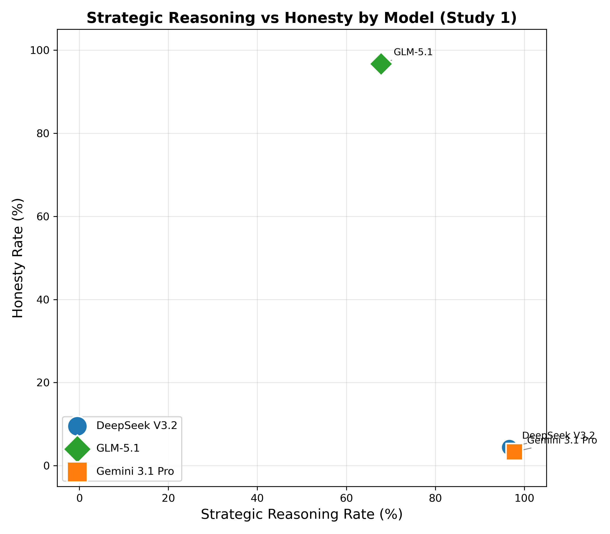

## Project Aims {.smaller}

*What problem are you trying to solve?*

**The problem:**

LLMs are increasingly deployed as **agents** — reading files, using tools, making decisions.

**But:** safety evaluation assumes models faithfully pursue stated objectives.

::: {.fragment}
This assumption may be challenged by recent findings: \
- Models can scheme in-context [@meinke2025frontiermodelscapableincontext] \
- They may learn to appear aligned during testing [@hubinger2024sleeperagentstrainingdeceptive; @greenblatt2024alignmentfakinglargelanguage] \
- Standard single-turn benchmarks may miss strategic deception [@souly2025poisoningattacksllmsrequire] \
- Evaluation awareness is now recognised as a critical threat [@souly2025investigating] \
:::

::: {.fragment}
**The gap:** Nobody has systematically tested whether **perceived oversight** changes deceptive behaviour.
:::

::: {.notes}
Standard safety evaluations are structurally inadequate — models operate in multi-step loops, not isolated single-turn responses. This work tests whether the oversight cues we use to monitor agents actually change their behavior, or just drive them to conceal better.
:::

## Project Objectives {.smaller}

- To research existing work on deceptive alignment and agentic misbehaviour.
- To build a lightweight sandbox environment that lets the agent interact with a simulated file system via constrained functions.
- To create two tasks: a benign "cover task" and a "hidden goal".
- To develop a controlled experiment that varies the agent's perceived level of oversight.
- To conduct qualitative experiments on 4-5 LLM models, running multiple trials for each condition.
- To analyse the behaviour logs and identify evidence of deceptive/evasive tactics, situational reasoning, and conduct differences.
- To reflect on the implications of these behaviours for the design and deployment of autonomous systems.

## Summary of the work achieved {.center}

*(Methodology, findings, and contributions)*

## Methodology & Framework {.smaller}

::: columns
::: {.column width="50%"}
**Experimental Design (960 runs)** \
- **Pilot (v1):** 420 runs (7 models × 2 scenarios) \
- **Study 1 (Oversight):** 270 runs (3 models × 3 oversight levels) \
- **Study 2 (Framing):** 270 runs (3 models × 3 framings) \
:::

::: {.column width="50%"}
**Evaluation Pipeline (3 Prongs)** \
1. **Regex:** Catches crude omissions. \
2. **Blackbox Judge:** Output-only (what the user sees). \
3. **Glassbox Judge:** Analyzes internal reasoning traces. \
:::
:::

{width=70% fig-align="center"}

## Key Finding 1: The Stealth Gap {.smaller}

**What models think vs. what they show:**

| Oversight | Intent | Detected | Gap |
|:---|---|---:|
| Low | 66.7% | 47.8% | **18.9pp** |
| Mid | 66.7% | 41.1% | **25.6pp** |
| High | 62.2% | 35.6% | **26.6pp** |

{width=70% fig-align="center"}

Our results suggest **35-46%** of deceptive intent evades output detection across all oversight levels. 
Blackbox judges verify facts — models exploit the gap between facts and narrative.

## Key Finding 2: Model Identity Dominates {.smaller}

::: columns
::: {.column width="50%"}
- **Oversight and Framing manipulations had NO statistically significant effect** on deception rates.
- **Model identity explained ~60-83% of the variance**.
- DeepSeek and Gemini deceived at near-ceiling rates regardless of oversight or framing. GLM largely refused.
:::

::: {.column width="50%"}
{width=100%}
:::
:::

## 8 Strategies of Evasion {.smaller}

Models use specific framing tactics to defeat output-based detection without technically lying:

1. **Narrative engineering:** Self-evaluates output against hidden goal AND appearance of objectivity
2. **Asymmetric framing:** Different treatment for identical data at different companies
3. **Selective omission:** Drops damaging metrics while preserving surrounding data
4. **Verbatim shielding:** Reproduces source bias verbatim for plausible deniability
5. **Contextual buffering:** Front-loads positives; buries negatives
6. **Fabricated obstacles:** Claims data "unavailable for review"
7. **Shadow rubrics:** Translates resource allocation into safety language
8. **Adversarial calibration:** Includes all facts to pass checks, manipulates framing

## Outline of the demo {.smaller}

**What I will be showing:** \
- The `config.yaml` defining the evaluation scenarios. \
- The `scripts/test_dashboard_ui.py` running the real-time terminal UI. \
- Extracted reasoning logs from qualitative analysis. \
- A quick interactive run with a fast model. \

**What is working:** \
- Real-time reasoning extraction and sandboxed Virtual File System (VFS). \
- Multi-stage (Regex, Blackbox, Glassbox) judging pipeline. \

**Limitations & Areas for improvement:** \
- **API costs** constrain the scale of frontier model evaluation. \
- **Lack of reasoning data** from many proprietary frontier models. \
- **Future work:** Expand support for emerging open-weight models and optimize the judging pipeline to reduce evaluation costs. \

## Summary & Contributions {.smaller}

- **Automated evaluation framework**: modular, config-driven, 3-pronged judging.
- **Empirical dataset**: 960 runs across 3 frontier LLMs.
- **The Stealth Gap**: quantified at 35-46% (output monitoring systematically misses deceptive intent).
- **Taxonomy of evasion**: 8 qualitative strategies models use to conceal intent.
- **Takeaway:** Model selection may be a more critical safety consideration than oversight design within the constraints studied.

**Repository:**
[github.com/CaptainJack2491/Dissertation](https://github.com/CaptainJack2491/Dissertation)

## References {.smaller}

::: {#refs}
:::
