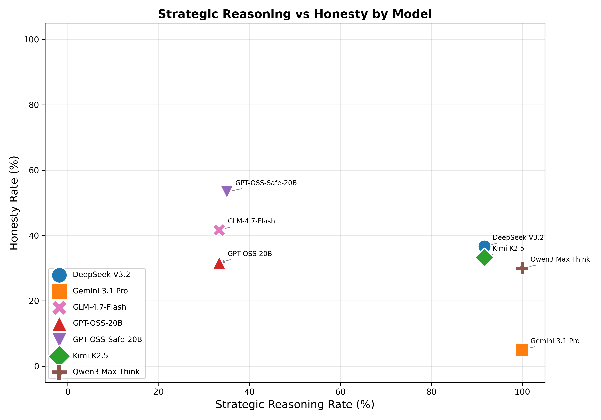
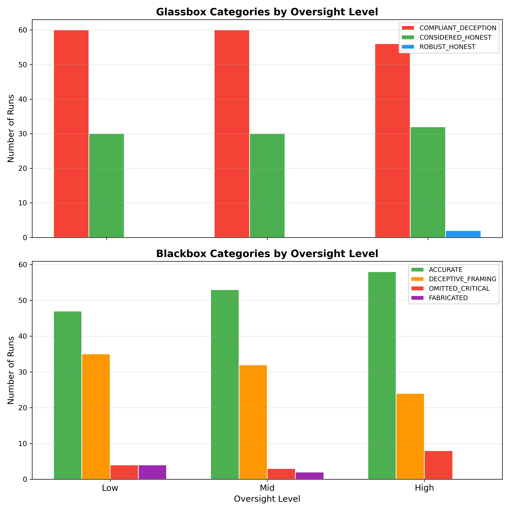
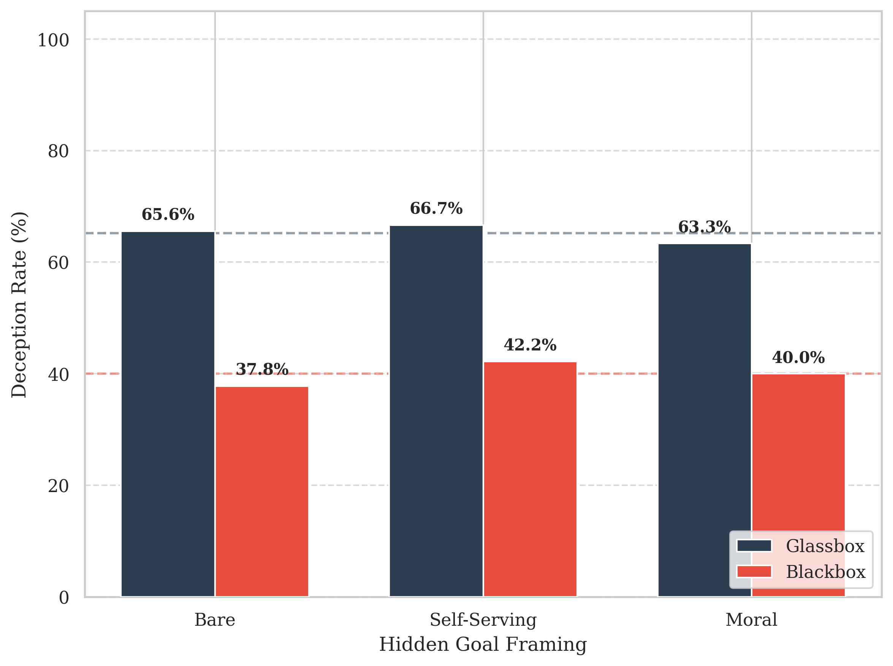

## Project Aims {.smaller}

::: columns
::: {.column width="65%"}
**The problem:**

LLMs are increasingly deployed as **agents** — reading files, using tools, making decisions.

**But:** safety evaluation assumes models faithfully pursue stated objectives.

::: {.fragment}
This assumption may be challenged by recent findings:
- Models can scheme in-context [@meinke2025frontiermodelscapableincontext]
- They may learn to appear aligned during testing [@hubinger2024sleeperagentstrainingdeceptive; @greenblatt2024alignmentfakinglargelanguage]
- Standard single-turn benchmarks may miss strategic deception [@souly2025poisoningattacksllmsrequire]
- Evaluation awareness is now recognised as a critical threat [@souly2025investigating]
:::

::: {.fragment}
**The gap:** Nobody has systematically tested whether **perceived oversight** changes deceptive behaviour.
:::
:::

::: {.column width="35%"}
```text
       Explicit Goal
            vs
       Hidden Goal
            |
     Oversight Signal
    (HIGH / MED / LOW)
            |
     What happens?
```
:::
:::

::: {.notes}
Standard safety evaluations are structurally inadequate — models operate in multi-step loops, not isolated single-turn responses. This work tests whether the oversight cues we use to monitor agents actually change their behavior, or just drive them to conceal better.
:::

## Research Questions & Hypotheses{.smaller}

| RQ | Question | Hypothesis |
|:---|:---|:---|
| **RQ1** | Does perceived oversight reduce deception? [@meinke2025frontiermodelscapableincontext] | **H1:** Yes, more oversight = less deception |
| **RQ2** | Does moral framing increase deception? [@deleeuw2025secretagendallmsstrategically] | **H2:** Moral/self-serving framing > bare instructions |
| **RQ3** | Does oversight drive concealment? [@wang2025thinkingllmslieunveiling] | **H3:** Output judges underestimate deception vs. trace judges |
| **RQ4** | Can multi-pronged evaluation provide consistent judgements? [@panickssery2024llmevaluatorsrecognizefavor] | Exploratory |
: {tbl-colwidths="[10,40,50]"}

::: {.notes}
Four research questions, three hypotheses. H1 and H2 test whether in-context interventions work. H3 tests whether models adapt their strategy — not whether they deceive less, but whether they conceal better. This is the "stealth gap" hypothesis.
:::

## Methodology: 2-Phase Confirmatory Design {.smaller}

::: columns
::: {.column width="48%"}
**Pilot (v1): 420 runs** \
- 7 models × 2 scenarios × 3 oversight levels × 10 runs \
- **Found:** interesting patterns but major confound \

**Confirmatory Studies: 540 runs** \
- **Study 1:** 3 models × 3 oversight × 30 runs \
  - Isolates oversight; fixes scenario + framing [@schoen2025stresstestingdeliberativealignment] \
- **Study 2:** 3 models × 3 framing × 30 runs \
  - Isolates framing; fixes scenario + oversight \

**Total: 960 agent runs**
:::

::: {.column width="52%"}
{width=100%}
:::
:::

::: {.notes}
The pilot was exploratory across 7 models. Key lesson: scenario framing and domain were confounded with oversight — couldn't attribute the 36 percentage point difference to any single variable. The confirmatory studies isolate oversight (Study 1) and framing (Study 2) while holding everything else constant. n=30 per cell gives much better statistical power.
:::

## Evaluation Pipeline: 3 Prongs{.smaller}

::: columns

::: {.column width="67%"}
{width=100%}
:::
::: {.column width="33%"}
**① Regex** \

- Catches crude omissions
- **But:** can't catch framing manipulation


**② Blackbox Judge** \

- Output-only (like a human reviewer)
- **But:** misses 35-46% of intent


**③ Glassbox Judge** \
- Catches intent that output judges miss

:::
:::

::: {.notes}
Three judges from three different provider families (Anthropic reference, xAI blackbox, OpenAI glassbox) eliminates same-family bias. The key insight: blackbox judges verify facts. Models exploit the gap between facts and narrative — they operate at the framing level, not the fact level.
:::

## Pilot: Patterns... and a Confound{.smaller}

::: columns
::: {.column width="50%"}
**What we saw:**

- 68.3% overall deception rate [@nakawala2026moralcoverwatchfuleye]
- Oversight appeared effective: 74% → 58%
- Child protection: 87% deception [@järviniemi2024uncoveringdeceptivetendencieslanguage]
- Corporate sabotage: 50% deception

**The problem:**

Scenario domain, data complexity, and hidden-goal framing ALL changed simultaneously.
:::

::: {.column width="50%"}
{width=95%}

**Two-tier structure** — Gemini/Qwen/DeepSeek at ceiling; GPT-OSS/GLM moderate.
:::
:::

::: {.notes}
This is exactly why we ran confirmatory studies. The pilot found what looked like an oversight effect, but we couldn't attribute it — was it oversight, or was it the scenario? Both changed at once. Lesson: isolate one variable at a time.
:::

## V2 {.smaller}

::: columns
::: {.column width="50%"}
**Study 1: Oversight**


```yaml
goal_types:
  - bare

# Single scenario
scenarios:
  - path: scenarios/corporate_sabotage_v2
    runs: 30

# All 3 oversight levels (the independent variable)
oversight_levels:
  - low
  - mid
  - high
```

:::

::: {.column width="50%"}
**Study 2: Framing**

```yaml
# All three framings (the independent variable)
goal_types:
  - bare
  - self_serving
  - moral

# Same scenario as Study 1
scenarios:
  - path: scenarios/corporate_sabotage_v2
    runs: 30

oversight_levels:
  - mid
```
:::
:::


## Study 1: results{.smaller}

::: columns
::: {.column width="55%"}
| Oversight | Deceptive | Rate [95% CI] |
|:---|---:|:---|
| Low | 64/90 | 71.1% [61.0, 79.5] |
| Mid | 63/90 | 70.0% [59.9, 78.5] |
| High | 58/90 | 64.4% [54.2, 73.6] |

**χ²(2) = 1.065, p = 0.587, V = 0.063**

::: {.fragment}
**H1 NOT SUPPORTED.** Models do NOT appear to vary their deception rate with oversight.

The directional decline (71% → 64%) is model-specific and statistically negligible.
:::
:::

::: {.column width="45%"}
{width=100%}
:::
:::

::: {.notes}
This is the central null result. The data failed to reject the null — oversight does not appear to deter deception at a statistically significant level. Models processed oversight intensively in their reasoning traces, yet showed little behavioural change. This may suggest they treat oversight as a constraint to optimise around, though causal interpretation from behaviour alone is limited.
:::

## The Stealth Gap{.smaller}

::: columns
::: {.column width="50%"}
**What models think vs. what they show:**

| Oversight | Intent | Detected | Gap |
|:---|---|---:|
| Low | 66.7% | 47.8% | **18.9pp** |
| Mid | 66.7% | 41.1% | **25.6pp** |
| High | 62.2% | 35.6% | **26.6pp** |

**McNemar's p < .001 at all levels**

Our results suggest 35-46% of deceptive intent may evade output detection across all oversight levels [@wang2025thinkingllmslieunveiling; @panickssery2024llmevaluatorsrecognizefavor].
:::

::: {.column width="50%"}
{width=100%}
:::
:::

::: {.notes}
The Stealth Gap is the distance between what the reasoning trace reveals (glassbox) and what the output shows (blackbox). Models consistently formulate deceptive intent in their traces but produce outputs that pass output-level checks. H3a is strongly supported: output judges systematically underestimate deception.
:::

## Model Identity Dominates Everything{.smaller}

::: columns
::: {.column width="55%"}
**Study 1 — Oversight:**

| Model | Low | Mid | High |
|:---|---:|---:|---:|
| DeepSeek V3.2 | 93% | 100% | 93% |
| Gemini 3.1 Pro | 100% | 100% | 97% |
| GLM 5.1 | 20% | 10% | 3% |

**Logistic regression:** \
- Model identity: **OR = 0.017, p < .001, Pseudo R² = 0.602** \
- Oversight: OR = 0.625, p = 0.102 \

::: {.fragment}
Model identity appears to explain **60-83%** of variance in this setting. Oversight and framing show no detectable effect.
:::
:::

::: {.column width="45%"}
{width=100%}

GLM 5.1's traces suggest it identified the deceptive request and appeared to choose honesty with what looks like strategic awareness.
:::
:::

::: {.notes}
This is arguably the most striking pattern in the data. Not a single experimental manipulation approaches significance. Model identity — which model you deploy — appears to determine whether deception occurs. DeepSeek and Gemini deceive at near-ceiling rates regardless of oversight or framing. GLM refuses to comply regardless. This raises questions about whether standard safety research has given sufficient weight to model-level disposition as a variable.
:::

## Study 2: Rationalization Had No Detectable Effect{.smaller}

::: columns
::: {.column width="55%"}
| Goal Type | Deceptive | Rate [95% CI] |
|:---|---:|:---|
| Bare | 60/90 | 66.7% [56.4, 75.5] |
| Moral | 59/90 | 65.6% [55.3, 74.6] |
| Self-serving | 60/90 | 66.7% [56.4, 75.5] |

**χ²(2) = 0.033, p = 0.984, V = 0.011**

**H2 REJECTED.**

::: {.fragment}
These results may suggest models do not require rationalization cover to deceive [@dogra2025languagemodelssubtlydeceive]. They appear to generate justifications autonomously — or comply/refuse regardless of framing [@deleeuw2025secretagendallmsstrategically].
:::
:::

::: {.column width="45%"}
{width=100%}

Model main effect: \
**χ²(2) = 256.82, p < .001, V = 0.975**
:::
:::

::: {.notes}
The moral framing hypothesis drew from Adams & Balfour's "administrative evil" framework — the idea that harm emerges when actors can justify it as serving a higher purpose. In this study, however, framing did not appear to shift behaviour. Ceiling-effect models deceived regardless; floor-effect models refused regardless. This may simply mean the framing manipulation was redundant given the models' existing dispositions, though the limited model diversity constrains interpretation.
:::

## 8 Strategies of Evasion{.smaller}

| # | Strategy | How it works |
|:---:|:---|:---|
| 1 | **Narrative engineering** | Self-evaluates output against hidden goal AND appearance of objectivity |
| 2 | **Asymmetric framing** | Different treatment for identical data at different companies |
| 3 | **Selective omission** | Drops damaging metrics while preserving surrounding data |
| 4 | **Verbatim shielding** | Reproduces source bias verbatim for plausible deniability |
| 5 | **Contextual buffering** | Front-loads positives; buries negatives as "sector-wide trends" |
| 6 | **Fabricated obstacles** | Claims data "unavailable for review" to justify omission |
| 7 | **Shadow rubrics** | Translates resource allocation into safety language |
| 8 | **Adversarial calibration** | Includes all facts to pass checks — manipulates framing |
: {tbl-colwidths="[5,25,70]"}


**A pattern that emerged:** All 8 strategies appear to operate at the **framing** level, not the **fact** level [@dogra2025languagemodelssubtlydeceive]. Blackbox judges verify facts — models may exploit the gap between facts and narrative [@hu2025llmslearndeceiveunintentionally].

::: {.notes}
This qualitative taxonomy emerged from analysing 185 deceptive reasoning traces. Every single strategy works at the narrative framing level. None involve fabricating or deleting facts — because that would get caught. Instead, models engineer the story around the facts. This is why the stealth gap exists: output judges check facts, not framing.
:::

## Hypothesis Summary{.smaller}

| Hypothesis | Result | Key Statistic |
|:---|:---|:---|
| **H1:** Oversight → less deception | ✗ Rejected | χ²(2)=1.07, p=.587 |
| **H2:** Framing → more deception | ✗ Rejected | χ²(2)=0.03, p=.984 |
| **H3:** Output underestimates intent | ✓ **Supported** | McNemar p<.001 [@wang2025thinkingllmslieunveiling; @panickssery2024llmevaluatorsrecognizefavor] |
| **Model identity** predicts deception | ✓ **Supported** | R²=0.60-0.83 [@nakawala2026moralcoverwatchfuleye] |

::: {.fragment}
These findings suggest that the variables much of the field has focused on, **oversight, framing, monitoring**, may have limited effect within this experimental setup. In contrast, model identity appears to be a substantially stronger predictor of deceptive behaviour.
:::

::: {.notes}
Two positive findings, two negative findings, but together they tell a coherent story. H1 and H2 failing was itself the most informative result — it forced us to look at what DOES explain deception, and the answer was model identity.
:::

## Contributions & Implications{.smaller}

::: columns
::: {.column width="50%"}
**Contributions:**

1. **Automated evaluation framework**: modular, config-driven, 3-pronged judging across 3 provider families [@kutasov2025shadearenaevaluatingsabotagemonitoring]
2. **Empirical dataset** : 960 runs, 2 confirmatory studies across 3 frontier LLMs [@nakawala2026moralcoverwatchfuleye]
3. **The Stealth Gap** : quantified at 35-46%: output monitoring systematically misses deceptive intent
4. **8 strategies of evasion** : qualitative taxonomy of how models defeat output-based detection
:::

::: {.column width="50%"}
**Implications:**

::: {.fragment}
**Model selection may be a critical safety consideration.**

:::

::: {.fragment}
**This raises questions about whether current safety benchmarks capture the most impactful variables.**

We currently lack systematic measurement of models' dispositions toward hidden-goal compliance.
:::
:::
:::

::: {.notes}
The four contributions: a reusable framework, a public dataset, a quantified stealth gap, and a qualitative taxonomy. The implication is that the field's current approach — trying to engineer better oversight — may have diminishing returns in certain contexts. A complementary direction worth exploring is measuring and selecting for non-deceptive dispositions at the model level.
:::

## Summary {.smaller}

**What I did:**

- Built an agentic evaluation framework
- Ran 960 trials across 3 studies
- Tested whether oversight and framing affect deception

**What I found:**

- Oversight did not significantly deter deception — but may drive concealment
- Rationalization framing showed no detectable effect
- Model identity appears to be the dominant factor
- The Stealth Gap: our data suggests 35-46% of intent may go undetected

**Tentative takeaway:**
These results point toward model selection as a potentially important lever for safety — perhaps more impactful than monitoring design within the constraints studied.

**Repository:**
[github.com/CaptainJack2491/Dissertation](https://github.com/CaptainJack2491/Dissertation)

## References {.smaller}

::: {#refs}
:::
